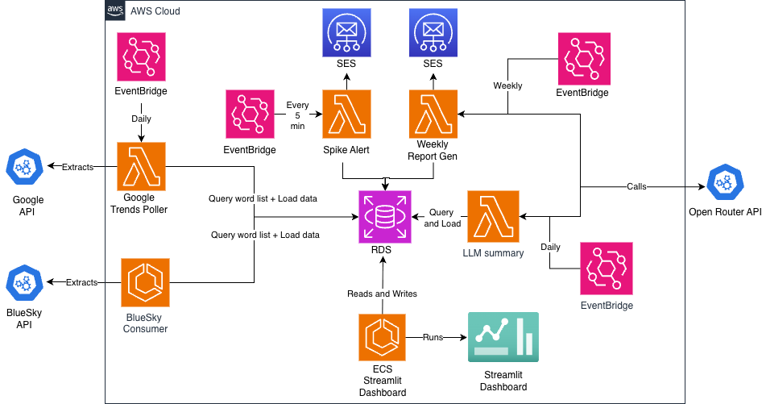
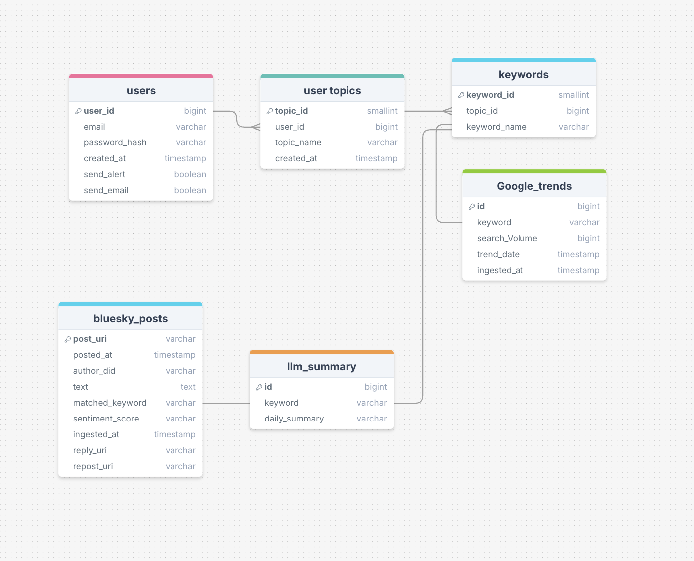

<div align="center">


# TrendFunnel - *Turning buzz into bizz!*

</div>

---

**TrendFunnel** is a real-time social media and search trend monitoring platform that funnels the noise of social media to identify the trends you care about. It combines multi-source data ingestion from Bluesky and Google Trends to deliver actionable insights through a live dashboard, AI-generated reports, and real-time email alerts.

## 🎯 The Problem

- **Millions of untapped conversations**: People share their thoughts daily on social media regarding brands, products, trends, celebrities, and politics — a huge reserve of data that could be leveraged for insights.
- **Siloed data sources**: Search trends and social conversations exist in isolation. Combining them could connect popular trends with consumer sentiment.
- **Shrinking trend lifecycles**: Traditional monitoring methods are too slow — trends often peak or shift before companies can act.

## 💡 The Solution

TrendFunnel addresses these challenges by:

| Feature | Description |
|---------|-------------|
| **Multi-Source Data Ingestion** | Automatically ingests real-time posts from Bluesky and search data from Google Trends |
| **Custom Keyword Tracking** | Tracks trends (volume & sentiment) related to your brand, niche, or competitor landscape |
| **Surge Detection & Alerts** | Identifies spikes in activity and alerts you in real-time via email |
| **Live Dashboard** | Real-time monitoring of tracked keywords and their performance |
| **AI-Generated Reports** | Daily and weekly reports with actionable insights |

## 👥 Target Users

- **Brand Marketing Teams** — Understand consumer sentiment, get alerted to viral trends for marketing opportunities
- **Product Managers** — Discover trending products in your industry and identify potential additions
- **Creators & Influencers** — Know what your audience likes, how they feel about you, and catch trends early to inform future content

---

## 🏗️ Architecture

TrendFunnel is built on AWS and follows a serverless, event-driven architecture:

<div align="center">



</div>

### Key Components

| Component | Technology | Purpose |
|-----------|------------|---------|
| **Data Ingestion** | AWS Lambda | Polls Google Trends API (daily) and Bluesky API (continuous) |
| **Scheduling** | EventBridge | Orchestrates pipelines — daily, every 5 min, and weekly triggers |
| **Database** | Amazon RDS (PostgreSQL) | Central data store for posts, keywords, trends, and user data |
| **Spike Detection** | Lambda + SNS | Detects activity surges every 5 minutes and triggers alerts |
| **Weekly Reports** | Lambda + SES | Generates and emails weekly summary reports |
| **LLM Summaries** | Lambda | Daily AI-generated insights using LLM |
| **Dashboard** | ECS + Streamlit | Interactive dashboard for real-time monitoring |

---

## 🗄️ Database Schema (ERD)

<div align="center">



</div>

### Tables Overview

| Table | Description |
|-------|-------------|
| `users` | User accounts with email, password hash, and notification preferences |
| `keywords` | Tracked keywords configured by users |
| `user_keywords` | Many-to-many relationship linking users to their tracked keywords |
| `bluesky_posts` | Ingested posts with text, sentiment score, and metadata |
| `matches` | Links posts to matched keywords |
| `google_trends` | Search volume data from Google Trends |
| `llm_summary` | AI-generated summaries per user |

---

## 📁 Project Structure

```
trends_tracker/
├── alert_system/          # Spike detection and email alerting
├── bluesky_pipeline/      # Bluesky data extraction, transformation, loading
├── dashboard/             # Streamlit dashboard application
├── database/              # Schema definitions and setup scripts
├── google_trends_pipeline/# Google Trends ETL pipeline
├── llm_summary/           # AI summary generation
├── terraform/             # Infrastructure as Code
└── weekly_report/         # Weekly report generation
```

---

## 🚀 Getting Started

### Prerequisites

- Python 3.9+
- AWS Account with configured credentials
- PostgreSQL database
- Docker (for containerized deployments)

### Local Development

1. Clone the repository
2. Set up your Python environment and install dependencies for each module
3. Configure environment variables for database and API credentials
4. Run the Streamlit dashboard locally:
   ```bash
   cd dashboard
   streamlit run app.py
   ```

## 🧪 Testing & Code Coverage

### Installation

Install pytest and coverage tools:

```bash
pip install -r requirements-dev.txt
```

### Running Tests with Coverage

Test coverage reports help ensure code quality. Run tests for specific components with branch coverage analysis:

#### Dashboard
```bash
cd dashboard
pytest --cov=. --cov-branch --cov-report=term-missing
```

#### Bluesky Pipeline
```bash
cd bluesky_pipeline
pytest --cov=. --cov-branch --cov-report=term-missing
```

#### Google Trends Pipeline
```bash
cd google_trends_pipeline
pytest --cov=. --cov-branch --cov-report=term-missing
```

#### Alert System
```bash
cd alert_system
pytest --cov=. --cov-branch --cov-report=term-missing
```

#### All Components (from root)
```bash
pytest --cov=. --cov-branch --cov-report=term-missing
```

### Coverage Flags

- `--cov=.` — Measure coverage for current directory
- `--cov-branch` — Include branch coverage in addition to line coverage
- `--cov-report=term-missing` — Display coverage report in terminal with missing lines highlighted

---

## 📄 License

This project is proprietary software developed for trend monitoring and analysis.

---

<div align="center">

**TrendFunnel** — *Never miss a viral moment or a PR crisis*

</div>
